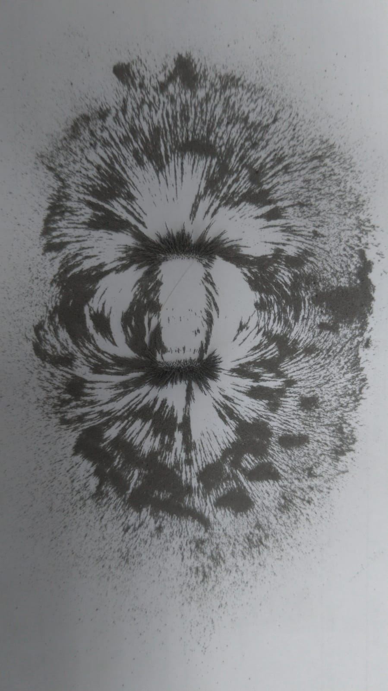
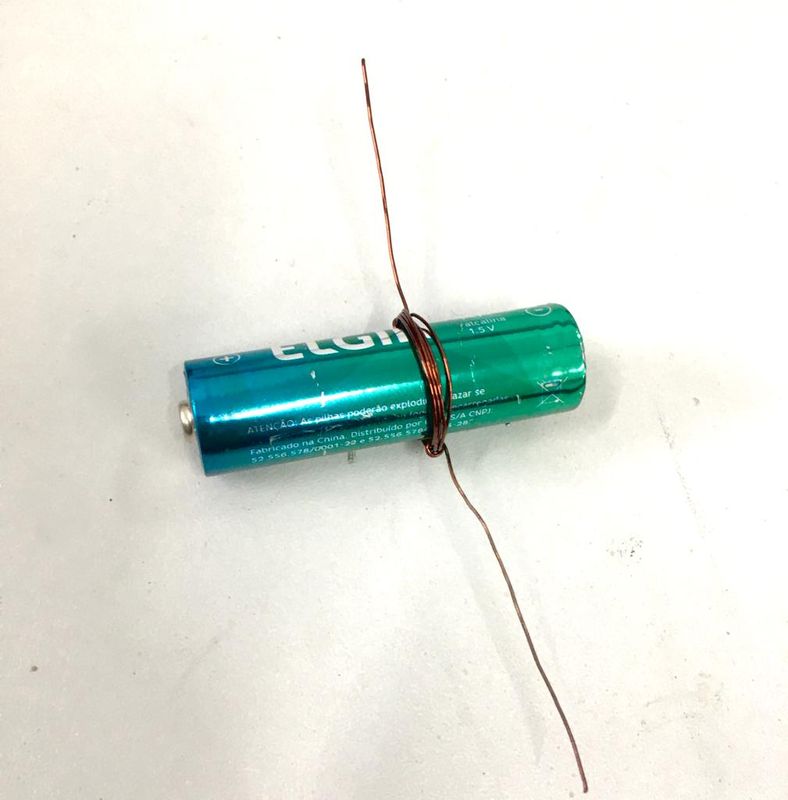
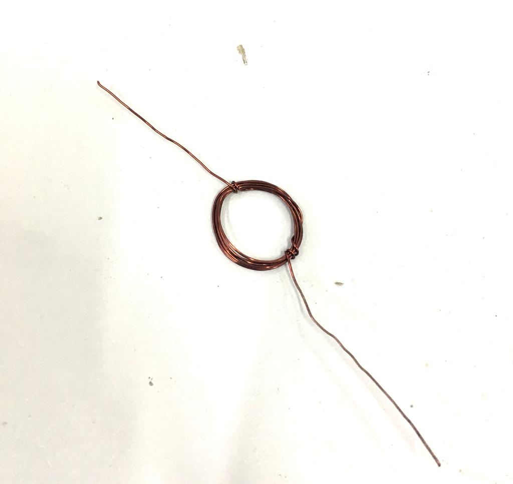
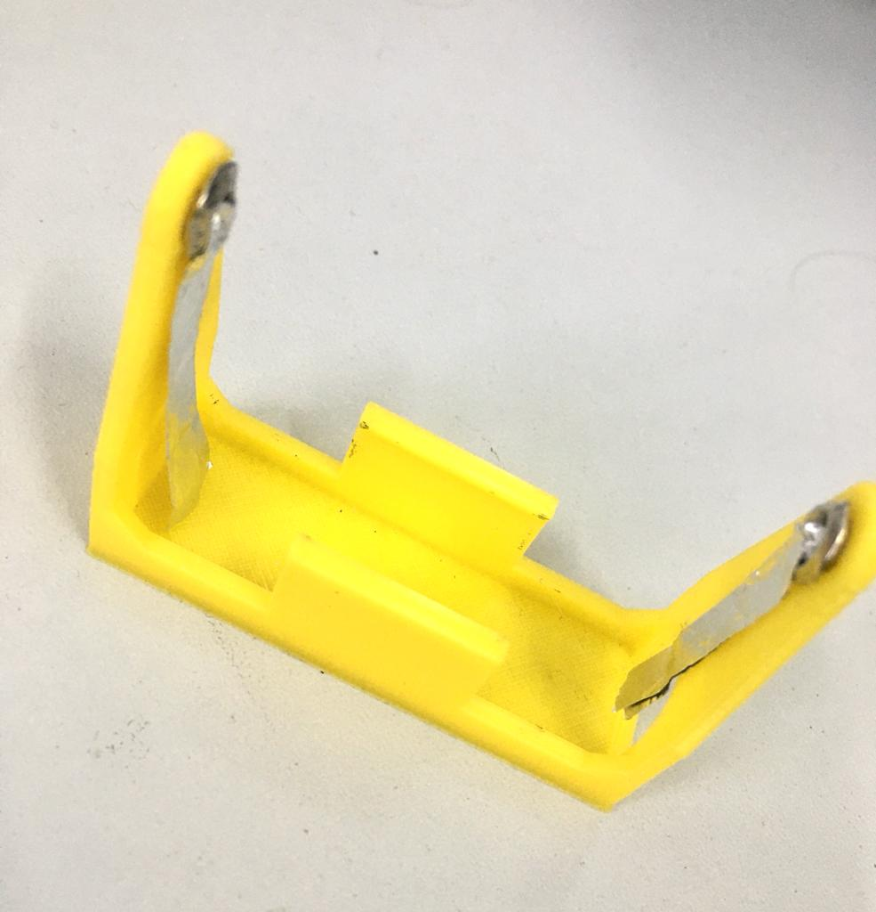
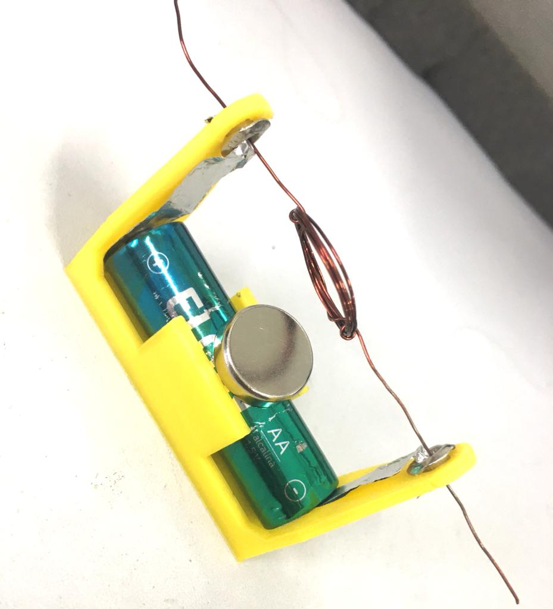

# motor-eletrico-elementar

## Objetivo
 O objetivo do projeto é apresentar o conceito de eletromagnetismo com uma aplicação prática de um motor elétrico elementar de corrente contínua observando a interação da bobina para com o ímã. 

 O modelo 3D estrutura utilizada para dar suporte ao projeto foi desenvolvida por Benjamin Deiss e disponibilizada no site thingiverse:
 [Clique aqui para acessar o Projeto](https://www.thingiverse.com/thing:3181182).

## Principio de funcionamento

 Exemplo do campo magnético gerado pelo ímã. Na figura foi utilizado pó de ferro, uma folha e um ímã. O ímã foi posicionado no centro e sob a folha, realinhando o pó de ferro de acordo com as linhas de campo.

<figure>
    
    <figcaption>Figura - Campo magnético do ímã.</figcaption>
</figure> 

 ## Material
Qntd | Descrição
-----|----------
1    | Pilha AA
1    | Ima De Neodímio Disco 10x4mm
2    | Ilhós 4mm
1    | 45 cm de Fio de cobre esmaltado AWG 24
1    | suporte da estrutura ([modelo 3D](src/3D/estrutura.STL))
1    | folha de papel alumínio 50x25 mm

## Passo a Passo

1) Enrolar o fio na pilha para formar a bobina. Deixar um pedaço de fio de cada lado para servir de suporte. Dar em torno de 9 voltas.

<figure>
    
    <figcaption>Figura - Criando bobina.</figcaption>
</figure> 

2) Retirar a bobina da pilha e enrolar a ponta do fio, em ambos os lados, na lateral da bobina.

<figure>
    
    <figcaption>Figura - Finalizando a bobina.</figcaption>
</figure> 

3) Imprimir o modelo 3D disponível [aqui](src/3D/estrutura.STL).
 
4) Cortar dois pedaços de papel alumínio com tamanho de 50x25 mm. O papel alumínio será utilizado como condutor elétrico;

5) Utiliza o ilhós para fixar o papel alumínio na estrutura:

<figure>
    
    <figcaption>Figura - Fixando papel alumínio na estrutura.</figcaption>
</figure> 

6) Em uma das pontas da bobina raspar apenas um lado do fio. Na outra ponta raspar o fio completamente.
    
7) Adicionando a pilha e a bateria na estrutura. Caso o ímã não seja atraído pela pilha é preciso fixá-lo utilizando uma fita adesiva:
<figure>
    
    <figcaption>Figura - Adicionando a pilha, a bobina e o ímã.</figcaption>
</figure> 

